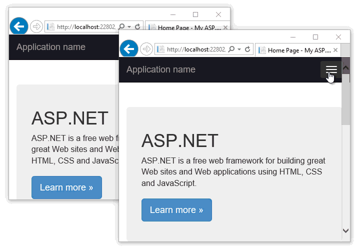
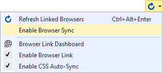
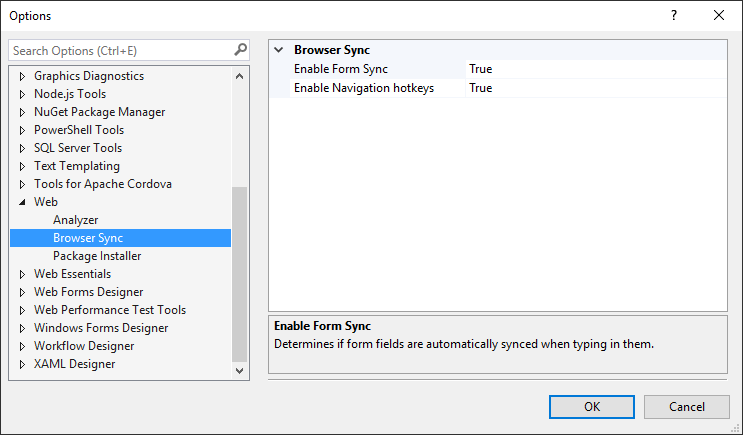

# Browser Sync
A Visual Studio extension for ASP.NET projects that
leverages Browser Link to synchronize form field entry,
page navigation and scroll position.

[](https://ci.appveyor.com/project/madskristensen/browsersync)

Download the extension at the
[VS Gallery](https://visualstudiogallery.msdn.microsoft.com/5741a548-5179-4a77-ad96-fca71535774d)
or get the
[nightly build](http://vsixgallery.com/extension/10d9b3af-1338-4c45-bc99-4ec38c3a11fb/)




## Features

1. Supports **all browsers** and emulators
2. Typing in input fields is synced across browsers
3. Keyboard hotkey to navigate all browsers to same URL
4. Keyboard hotkey to synchronize scroll position
5. Settings to enable/disable it all

For Browser Sync to work, make sure that Visual Studio's
Browser Link is up and running. Do that by running an
ASP.NET application from Visual Studio in one or more
browsers.

Hovering over the Browser Link button on the Standard
toolbar lets you know if Browser Link is connected.


### Form field sync
This extension registers when typing occurs in these
HTML elements:

**Input**
```html
<input value="" id="email" />
```

**Textarea**
```html
<textarea name="text"></textarea>
```

The elements MUST have either an/or _id_ or _name_ attribute
for the sync to work.

### Navigation and scroll position
When you have multiple browser windows open onto the
website your building in Visual Studio, it is handy to
be able to navigate all the browsers to the same page on
your site.

Browser Sync makes that easy. Simply navigate to a page
on your site and hit **CTRL+ALT+Enter** in the browser.

That will navigate all the other browses to that same page.

Hit **CTRL+Alt+Enter** again and all browsers will move
to the same scroll position.

### Settings
You can disable Browser Sync very easily from the Browser
Link dropdown on the Standard toolbar.



This will disable both the navigational sync using hotkeys
as well as the form field sync.

Both of those settings can be individually set in the
**Tools -> Options -> Web -> Browser Sync** dialog.



## License

[Apache 2.0](LICENSE)